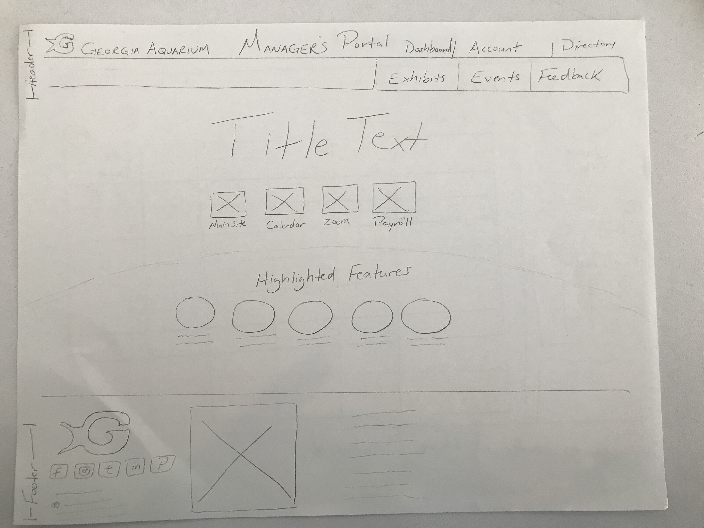
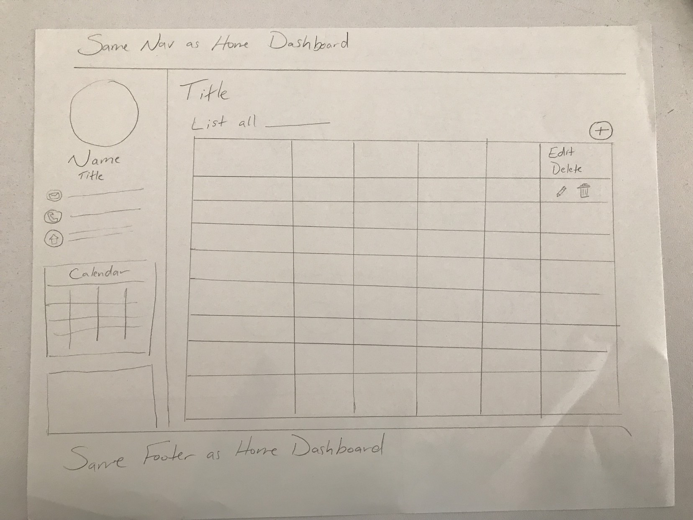
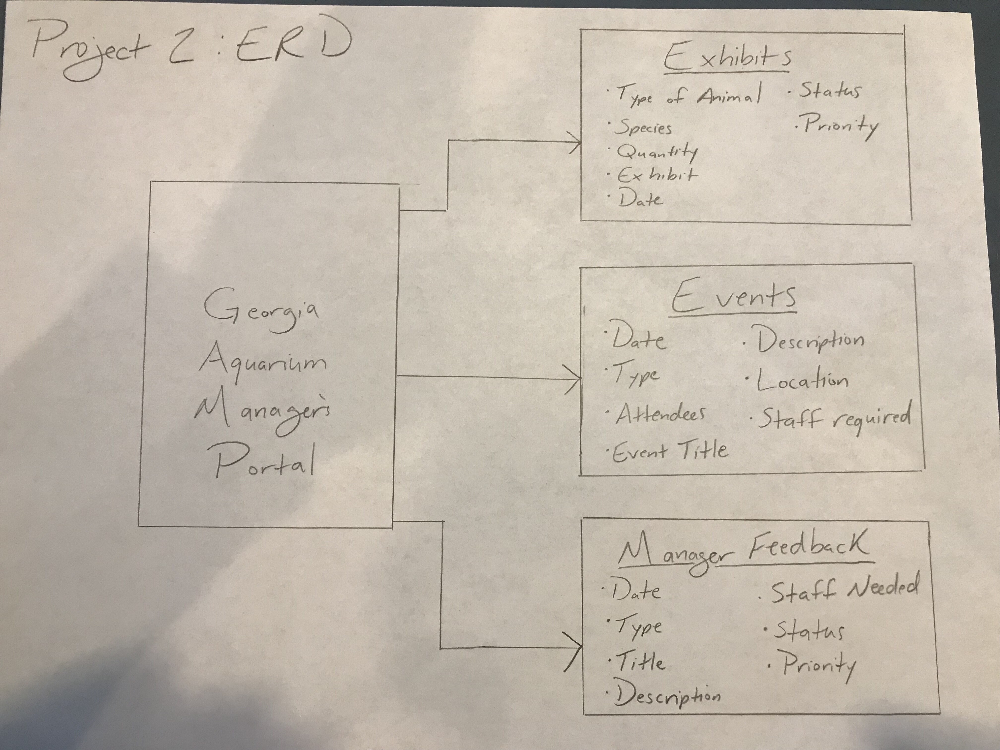

# Georgia Aquarium: _Managers Portal_

#### This site is designed to allow the leadership personnel and exhibit managers to view, create, delete, and update the animal exhibits and events for the Georgia Aquarium. The site also provides a platform for managers to give feedback to the GA team members. Given the Georgia Aquarium's commitment to research, conservation and sharing the amazing world of undersea life with the public, this site is designed to increase efficency and communication between team members. 

##### Important Links:
[**Deployed Site**](https://pacific-spire-28763.herokuapp.com/)

[GitHub Link](https://github.com/brittmagee/SEI23-Project2)

[Project board](https://github.com/brittmagee/SEI23-Project2/projects/1)

<dl>
  <dt>Tech Specs</dt>
    <dd>HTML5</dd>
    <dd>CSS</dd>
    <dd>JavaScript</dd>
    <dd>Node.js</dd>
    <dd>Express.js</dd>
    <dd>MongoDB.js</dd>
    <dd>Mongoose</dd>
</dl>

#### This application has: 

* Three models – one that enables a manager to add/remove animals to the various exhibits, one that enables a manager to view/edit the upcoming events, and a third model that enables managers to provide feedback geared towards the safety of the exhibit animals.
* Complete RESTful routes for each of the modles with GET, POST, PUT, and DELETE.
* Uses Mongo queries and the Mongoose module to interact with a document database.
* CSS styling to mimic an actual manager's portal platform.
* Wireframes that were designed during the planning process.
* ERD
* Deployed online and accessible to the public via Heroku

### Wireframe & ERD Images

